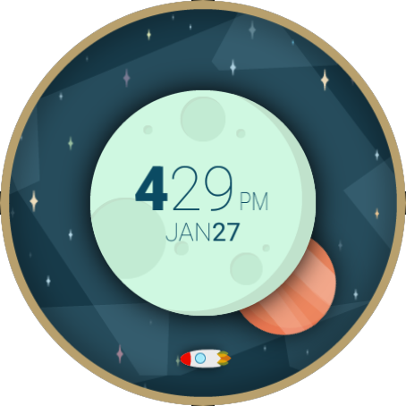

# Space and Time Watch Face

This is a [Watch Face Format (WFF)](https://developer.android.com/training/wearables/wff) version of an old watch face that I liked a lot by [Geng Gao](https://play.google.com/store/apps/details?id=net.genggao.spaceandtime). It hasn't been updated since 2015 and I wanted a new version of it for my new Pixel watch. 

## Implementation

It wasn't super challenging to implement. I vectorized the original design, so I could scale up to the new 450px x 450px screen (original was 320px x 320px). After that, I decided to forgo [Watch Face Studio](https://developer.samsung.com/watch-face-studio/user-guide/index.html) and go for [WFF XML](https://developer.android.com/training/wearables/wff/watch-face), WFS didn't really provide all the features that I wanted (mostly text layout). Finally, I created the [XML](app/src/main/res/raw/watchface.xml) and turned it into an Android project.

## Running and Building

- `./gradlew assembleDebug` - build debug APK
- `./gradlew assemble` - build debug and release APK's

